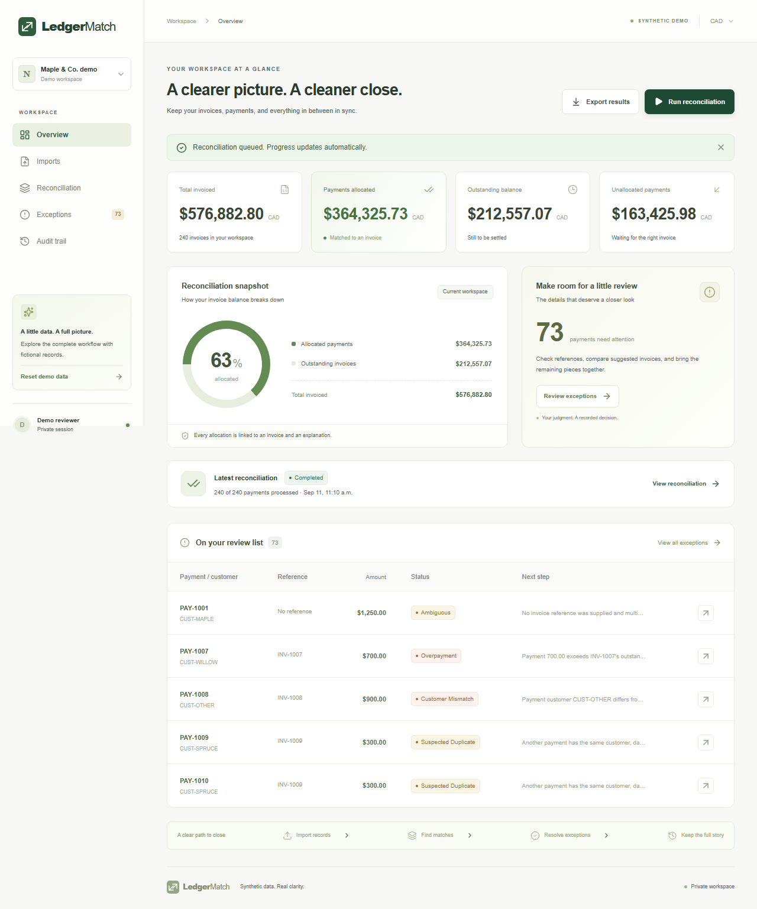

# LedgerMatch

A transaction reconciliation and exception-review application built with Next.js, TypeScript and PostgreSQL. Import invoices and payments, run explainable matching, review exceptions, reverse decisions, and export the results.

Now includes a trained **XGBoost invoice ranker**, shared TypeScript training/inference features, calibrated human-review recommendations, leakage-safe synthetic experiments and an interactive [model evaluation dashboard](http://127.0.0.1:3000/evaluation). The checked-in model runs directly in Node; Python is needed only to retrain. Set `ML_ENABLED=false` to use the original heuristic workflow.

See [generated benchmark results](docs/benchmark-results.md), [measured XYZ resume bullets](docs/resume-metrics.md), and [ML methodology and reproduction commands](docs/ml-matching.md). All metrics come from executable experiments; predictive results use held-out synthetic data and reviewer productivity is labeled as a proxy.

**Synthetic portfolio demo only. No bank connections or money movement.**



## Run locally

Requires Node.js 22.12+ (verified with 24.13), Docker Desktop/Engine with Compose, and npm.

```sh
npm ci
```

Copy `.env.example` to `.env`. Set `SESSION_PASSWORD` to a unique random value of at least 32 characters. Generate one with:

```sh
node -e "console.log(require('node:crypto').randomBytes(48).toString('base64url'))"
docker compose up -d db
npm run db:migrate
npm run dev
```

In a second terminal:

```sh
npm run worker
```

Open **http://127.0.0.1:3000** (use that origin, matching `.env`). Choose **Try demo → Load sample data → Run reconciliation**. Open **Exceptions → PAY-1001**, choose `INV-1001`, enter a note, and allocate. Review the updated balances and audit trail, then export. [Two-minute walkthrough](docs/demo.md).

For the full production container setup instead of host Node processes:

```sh
docker compose up --build -d
docker compose ps
```

Stop host app/worker processes first to release port 3000. Compose builds the application, applies migrations, and starts app, worker and PostgreSQL. `docker compose down` preserves the data volume. The `.env` file is ignored by Git and Docker builds.

## Features

- CSV upload, header mapping, whole-file validation, physical row errors, templates, import history, and duplicate/conflict detection.
- Exact integer-cent money; unique explicit references can match automatically, including partial and subsequent payments. Ambiguous, duplicate, mismatched and overpaid records require review.
- Durable pg-boss jobs, progress, retries, worker fencing and recovery; PostgreSQL constraints and transactions protect financial effects.
- Isolated expiring demo sessions; reviewer/viewer membership checked on the server; same-origin mutation protection.
- Ranked suggestions, compatible invoice search, reviewer notes, reversal, retained evidence, paginated results, accounting totals and safe CSV exports.
- ML ranks compatible exception candidates after deterministic matching; calibrated confidence can recommend or abstain, and every model-assisted allocation requires human confirmation.
- Reset opens a freshly seeded workspace and preserves the previous workspace's historical evidence.

## Verification and fixtures

Keep PostgreSQL running. Integration tests create isolated workspaces and retain their evidence; use a disposable database for repeated runs.

```sh
npm run lint
npm run typecheck
npm test
npm run test:integration
npm run build
npx playwright install chromium
npm run test:e2e
```

Browser tests require the app **and separate worker** running at the configured origin. Set `PLAYWRIGHT_BASE_URL` to test another origin. Screenshots/traces appear under `test-results`; open the report with `npx playwright show-report`.

```sh
npm run fixtures -- 12
npm run fixtures -- 240
npm run benchmark -- 1000 10000 100000
npx tsx --env-file=.env scripts/profile.ts
```

CSV fixtures and separately authored ground truth are written under `artifacts/datasets`. Benchmark commands measure real PostgreSQL imports and the same handler used by the worker, excluding queue wait. [Measured results and limitations](docs/verification.md). `npm run db:seed` creates a CLI inspection workspace; browser sessions should use Load sample data.

## Design and handoff

- [Architecture, schema, concurrency and recovery](docs/architecture.md)
- [Versioned matching rules](docs/matching-rules.md)
- [Synthetic data and ground truth](docs/data.md)
- [Local and hosted deployment steps](docs/deployment.md)
- [Demo script](docs/demo.md)
- [Verification, benchmarks and resume bullets](docs/verification.md)

Schema changes are ordered SQL migrations with checksums and transactional application. Drizzle provides typed membership queries; financial repositories use parameterized SQL for set-based operations and explicit locking. Applied migrations must remain unchanged.

## Limits

CAD only; 20 MiB CSV files; 100,000 rows per import and at most 100,000 records of each type per workspace; CAD 100 million maximum per record; 20 reconciliation submissions per workspace per hour; 500 new demo workspaces per server hour. Tables use 25-row pages, invoice selection returns 100 searchable results, candidates are bounded and heuristic, exports are bounded but buffered in memory.

Sessions expire after seven days. There is no public hosting provisioned, invitation UI, identity recovery, automatic retention cleanup, streaming export, or bank integration. Old demo/test evidence consumes storage until an operator retires the disposable database. Reset does not currently expose an archive browser. A production financial system would require further operational, security and accounting review. Deferred scope includes FX, fees/refunds, splitting payments, billing, and AI advice.
