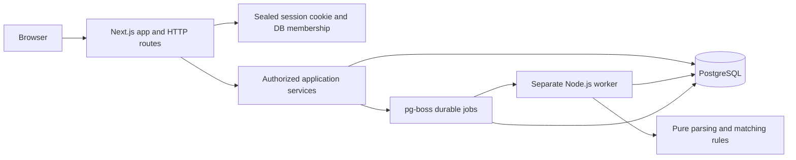

# Architecture

LedgerMatch is a single application with a separate durable worker and one PostgreSQL database. It is a synthetic portfolio demonstration: it neither moves money nor connects to bank accounts.

`src/domain` owns exact money parsing, CSV validation, deterministic matching and synthetic fixtures. It has no Next.js or database dependency. `src/server` owns sessions, authorization, transactions and persistence. Route handlers validate requests and call services; React components present server results. PostgreSQL stores both application data and the pg-boss queue. A browser refresh never runs a background job.

## Money and evidence

All persisted amounts are positive integer CAD cents in PostgreSQL `bigint` columns. Decimal input is parsed exactly; excess precision is rejected. The PostgreSQL driver rejects integers outside JavaScript's safe range. Invoice balances are derived from active allocations through `invoice_balances`; no second mutable balance is maintained. Tests assert both invoice and payment accounting identities.

Each allocation transfers one entire payment to one invoice. Multiple payments can settle an invoice, including partial payments. The payment remains a distinct record and its review status is independent of invoice settlement status. Automatic allocations persist the rule version, explanation and evidence (reference, amount and outstanding balance before/after). Reversal marks an allocation inactive with a required reason, retaining the original row. Decisions and audit rows retain reviewer actions. Database triggers reject ordinary updates/deletes of historical evidence; database administrators can still alter the schema or data. This is an application audit trail, not a cryptographically tamper-proof ledger.

## Import boundaries

An import validates the entire file before writing domain records. A workspace/type-scoped content hash prevents replay of the same file; workspace/record-ID uniqueness prevents reordered files from duplicating records. Repeated identical records are skipped; conflicting identifiers reject the import transaction. Imports retain normalized input rows as evidence. Column mapping applies before domain validation. Formula-leading cells in CSV exports are neutralized for spreadsheets.

## Authorization and concurrency

The browser receives an iron-session sealed cookie containing a session identifier. The server resolves that identifier to an unexpired database session and membership. Every application service checks the workspace/principal membership; reviewer permission is required for mutations. Workspace selection is not accepted as client authority. Composite foreign keys tie invoices, payments, allocations and runs to their workspace. Demo reset creates and seeds a fresh isolated workspace, switches the session, and retains the previous workspace's evidence; it does not erase audit history or alter another user's data.

Mutations serialize on the workspace row. Imports and manual decisions are rejected while a run is queued/running, protecting the matching snapshot. This deliberately sacrifices same-workspace write throughput for easy-to-audit consistency in a portfolio-scale application. Different workspaces can proceed independently. A partial unique index permits at most one active allocation per payment. An allocation trigger locks and validates the invoice/payment, whole-payment amount, customer, currency and outstanding balance. The service transaction commits allocation, decision and audit evidence together. Integration tests race competing reviewers and competing payments, and inject an audit failure to verify rollback.

## Durable reconciliation

Runs have queued, running, completed and failed states with processed/total counts. A partial unique index permits only one queued/running run per workspace. The separate worker consumes pg-boss jobs with at-least-once delivery, so service effects must remain idempotent.

Recovery safely repeats matching against persisted active allocations and current balances. Existing allocations are preserved; database uniqueness prevents repeated effects. Reversed/deferred payments remain for intentional human review. Progress commits in batches of at most 100 effects; a later attempt can repeat unfinished work. Jobs allow three retries with a three-second initial delay and exponential backoff, and use a 30-second heartbeat (automatically renewed by pg-boss) and a one-hour absolute attempt limit. A workspace advisory lock prevents two workers from processing the same workspace concurrently. Every batch rechecks the run state under a workspace lock. Terminal failure marking must acquire that same advisory lock, so an expired queue attempt cannot unlock editing while an older worker still commits. The integration suite injects a failure after committed progress and retries the same run ID; the browser suite requires a real worker to consume the queue.

## Matching tradeoffs

Deterministic rules are explainable and reproducible on exact financial fields. Rule version `1.0.0` processes payments by ISO payment date then lexicographic payment ID. It preserves human decisions and flags suspected duplicates before attempting a unique explicit reference. Unicode NFKC/case normalization preserves separators; whole-token matching prevents `INV-12` from matching `INV-123`. Customer (when supplied), currency and outstanding amount must agree. Missing/ambiguous references yield ranked suggestions using customer, amount and date; suggestions never allocate automatically and scores are not probabilities.

Candidate search is bounded, so large workspaces can contain compatible invoices outside the top suggestions. Manual invoice search provides a review path. There is no arbitrary subset-sum matching, payment splitting, foreign exchange or bank integration. PostgreSQL rather than an extra Redis service keeps deployment small and gives the queue durable storage alongside application data.

## Verification boundaries

Unit tests isolate parsing and rule behavior. PostgreSQL integration tests exercise imports, authorization, reruns, concurrent allocation, rollback and reversal. Browser tests exercise the actual HTTP/session/UI/queue path and save desktop/mobile screenshots. Integration fixtures use fresh workspace UUIDs and retain evidence; use a disposable test database when testing repeatedly. Benchmarks must distinguish pure domain timing from PostgreSQL import and reconciliation timing and report independent fixture ground truth.
